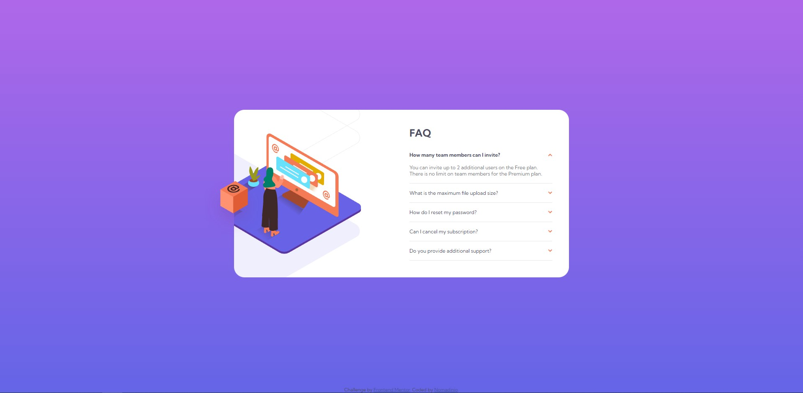

# Frontend Mentor - FAQ accordion card solution

This is a solution to the [FAQ accordion card challenge on Frontend Mentor](https://www.frontendmentor.io/challenges/faq-accordion-card-XlyjD0Oam). Frontend Mentor challenges help you improve your coding skills by building realistic projects. 

## Table of contents

- [Overview](#overview)
  - [The challenge](#the-challenge)
  - [Screenshot](#screenshot)
  - [Links](#links)
- [My process](#my-process)
  - [Built with](#built-with)
  - [What I learned](#what-i-learned)
- [Author](#author)

**Note: Delete this note and update the table of contents based on what sections you keep.**

## Overview

### The challenge

Users should be able to:

- View the optimal layout for the component depending on their device's screen size
- See hover states for all interactive elements on the page
- Hide/Show the answer to a question when the question is clicked

### Screenshot

### Links

- [Solution URL](https://www.frontendmentor.io/solutions/faq-accordion-card-BI59sRJzHy)
- [Live site URL](https://candid-caramel-8b1829.netlify.app/)

## My process

### Built with

- HTML
- SCSS
- Flexbox
- Javascript
- Mobile-first workflow

### What I learned

I didn't know how to do the Active States just by using CSS, I was trying to find a solution for that quite some time, but then I decided to try this step by using JS and I'm really happy how it turned out at the end. Apart from that, I will stick to uploading SVG in img tag with next project.

## Author

- Frontend Mentor - [@Nomadinio0](https://www.frontendmentor.io/profile/Nomadinio0)